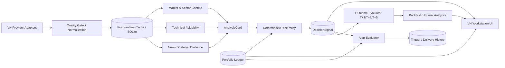

# VN Trading Workstation — Blueprint và backlog hoàn thiện

> Baseline: 2026-07-22 13:45 GMT+7  
> Phạm vi: Web tại `http://127.0.0.1:5173`, backend FastAPI `:8000`, dữ liệu SQLite `data/stock_analysis.db`.

## 1. Kết luận điều hành

Ứng dụng hiện có nhiều khối kỹ thuật tốt nhưng mới đạt trạng thái **generic framework + VN workspace MVP**. Nó chưa phải một workstation VN/T+ khép kín vì dữ liệu đang bị chia thành nhiều nguồn sự thật:

- `/vn-portfolio` dùng text/localStorage và gọi phân tích tức thời;
- `/portfolio` dùng ledger SQLite bền vững;
- VN journal dùng JSONL;
- AI signals dùng bảng `decision_signals`;
- backtest dùng `analysis_history`/`backtest_results` generic;
- VN alerts trong workspace dùng localStorage, trong khi Alert Center dùng DB riêng.

Hướng đúng không phải thêm tiếp page hoặc card. Hướng đúng là **hợp nhất contract dữ liệu và workflow** để tạo vòng lặp:

```text
Market data → Scan/Analyze → DecisionSignal → RiskPolicy
            → Portfolio/Alert → Journal/Outcome → Backtest/Learning
```

## 2. Bằng chứng baseline live

### Runtime

- Vite dev server: `127.0.0.1:5173`.
- FastAPI: `0.0.0.0:8000`, auth hiện tắt.
- Backend startup thực tế khoảng 27 giây.
- VN readiness: HTTP 200.
- VN portfolio account snapshot sau P0 slice: HTTP 200 khoảng 4–5 giây, 16 vị thế, currency VND.
- All-account snapshot: HTTP 200 khoảng 4 giây, aggregate CNY và FX stale.

### Dữ liệu hiện tại

| Domain | Số bản ghi |
|---|---:|
| analysis_history | 1 |
| decision_signals | 1 |
| decision_signal_outcomes | 0 |
| backtest_results | 0 |
| backtest_summaries | 0 |
| alert_rules / triggers / notifications | 0 / 0 / 0 |
| portfolio_accounts | 2 |
| portfolio_trades | 18 |
| portfolio_positions | 16 |
| portfolio_position_lots | 18 |
| portfolio_daily_snapshots | 4 |
| stock_daily | 0 |
| news_intel | 0 |
| VN JSONL journal | 1 item qua API |

Ý nghĩa: ledger portfolio đã có dữ liệu thật, nhưng signal → outcome → backtest và alert persistence chưa vận hành end-to-end.

## 3. Kiến trúc đích



### Nguyên tắc bắt buộc

1. **Ledger SQLite là source of truth cho portfolio.** localStorage chỉ là draft, không phải vị thế thật.
2. **DecisionSignal là source of truth cho mọi khuyến nghị có thể kiểm chứng.** Journal không tạo schema riêng tối giản.
3. **UI đọc cache nhanh; refresh nguồn ngoài là tác vụ riêng có timeout/circuit-breaker.** Không để một provider treo cả page.
4. **Mọi kết quả có `ref_date`, `generated_at`, source/provider, unit, freshness, quality flags.**
5. **Không dùng bar chưa hoàn tất cho EMA/RSI/MACD/ATR/RS.** Live quote chỉ là alert/execution layer.
6. **RiskPolicy quyết định allowed action/size sau phân tích.** Narrative hoặc score không được vượt hard gate.
7. **Partial failure giữ partial result.** News lỗi không xóa technical; chart lỗi không xóa ActionPlan; risk lỗi không xóa snapshot.
8. **Không tự đặt lệnh.** Web là decision-support, journal và monitoring.

## 4. Information architecture VN-first

### Navigation đề xuất

1. **Hôm nay** — market regime, breadth, portfolio risk, alerts, task list.
2. **Scanner T+** — universe, filters, RS, liquidity, Top setup.
3. **Phân tích mã** — chart, indicators, sector, news evidence, ActionPlan.
4. **Portfolio** — ledger canonical, T+ inventory, concentration, drawdown, trade entry/import.
5. **Cảnh báo** — persistent rules, triggers, delivery status, cooldown.
6. **Nhật ký & Kiểm chứng** — signals, fills, notes, T+ outcomes, attribution.
7. **Nghiên cứu/Backtest** — VN signals only by default; generic markets đặt ở advanced mode.
8. **Cài đặt & Sức khỏe dữ liệu** — provider, auth, backup, source health.

### Loại bỏ nhầm lẫn hiện tại

- Không để `/vn-portfolio` và `/portfolio` biểu diễn hai portfolio độc lập.
- `Portfolio T+` phải là view tác nghiệp trên cùng ledger, không phải textarea source-of-truth.
- Các nhãn tiếng Trung/Anh còn lại trong Portfolio, Alerts, Backtest, Decision Signals phải có bản dịch tiếng Việt đầy đủ.
- Chỉ hiện generic A/H/US modules khi bật advanced/multi-market mode.

## 5. Contract dữ liệu tối thiểu

### MarketDataSnapshot

```text
symbol / market / exchange
ref_date / bar_date / fetched_at / timezone
price_unit / value_unit
open high low close volume value
is_completed_bar / is_live / is_cached
provider / provider_version / source_url
quality_status / warnings / content_hash
```

### AnalysisCard

```text
status: valid | neutral | abstained | failed
technical + liquidity
market + sector
news/catalyst evidence
counter-evidence / falsifiers
coverage / confidence
ref_date / snapshot_hash / source_ids
```

### DecisionSignal

```text
signal_id / strategy_version / ticker
ref_date / first_tradable_session
ActionPlan action
buy zone / breakout trigger / stop / targets
suggested size band
market + sector regime
portfolio constraints
quality flags / evidence ids / snapshot hash
status / expires_at
```

### Outcome

```text
T+1 / T+3 / T+5 return
MFE / MAE
stop/target first hit
fees / sell tax / stressed slippage
benchmark + sector-relative return
liquidity/capacity flags
corporate-action adjustment state
```

## 6. Backlog ưu tiên

## P0 — Độ tin cậy và một nguồn sự thật

### Ma trận blocker hợp nhất từ 3 audit độc lập

| Blocker | Trạng thái / bằng chứng | Acceptance gate |
|---|---|---|
| Refresh thành công giả | Đã tái hiện: `Promise.allSettled()` trước đây luôn cập nhật “Lần cuối” | Chỉ ghi thời gian thành công khi toàn bộ panel được yêu cầu thành công; partial/all-failed phải giữ dữ liệu cũ và báo đúng trạng thái. **Đã triển khai trong vertical slice thứ hai.** |
| Partial-bar contamination | VNDIRECT lấy tới ngày hiện tại và scanner dùng bar cuối; probe làm `volumeRatio 1.0 → 0.05249`, RSI thành `0.0` | EOD/T+ chỉ dùng completed T-1; intraday phải là mode riêng có session/cutoff/bar status. |
| VND/thousand-VND mismatch | Ad-hoc portfolio có thể trả current/P&L bằng VND nhưng stop/target bằng nghìn VND | Mọi price field có explicit unit/currency; canonical portfolio dùng VND; bỏ magnitude heuristic. |
| Hai portfolio song song | VN request tự tính holdings trong khi canonical ledger đã có lots/settlement/risk | `/vn-portfolio` đọc canonical `PortfolioService`/`PortfolioRiskService`; ad-hoc endpoint chỉ là compatibility adapter rồi loại bỏ. |
| Ledger event có thể hard-delete | API cho phép xóa trade/cash/corporate action đã thực thi | Executed event immutable; sửa sai bằng reversal/correction có actor, reason, superseded id và audit hash. |
| Missing price tạo false-safe | Một số path có thể đưa market value/cost basis về 0 khi không định giá được | Snapshot có `complete/degraded/unvalued`; valuation/risk bị block hoặc dùng last-known-good có timestamp, không báo an toàn giả. |
| Auth/LAN fail-open | Docker/public bind có thể chạy khi auth tắt | Public bind + auth off phải fail startup; localhost-only mới được opt-out rõ ràng. |
| Healthcheck thành công giả | Docker healthcheck có fallback exit 0; health endpoint không kiểm DB/worker | Tách live/ready; dependency failure trả 503; Docker chỉ dựa trên ready endpoint thật. |
| Chưa có restore drill | SQLite/WAL chưa có backup/restore workflow được kiểm chứng | Online backup, checksum, integrity/FK/schema/replay verification và restore vào DB mới. |
| Backtest execution leakage | Signal/outcome có thể dùng close cùng ngày dù signal tạo sau close | Có `signal_created_at`, cutoff và first tradable price; test no-future-leakage, fees/tax/slippage/T+/cash. |

### P0.0 Refresh truthfulness và panel state machine

- Mỗi panel có state `idle/loading/success-empty/success-data/partial/error`.
- Refresh giữ last-known-good result và ghi panel nào stale/error.
- `last_success_at` không được dùng thay `last_attempt_at`.
- Overview, alerts, playbook và portfolio không chia sẻ một trạng thái thành công giả.

**Acceptance criteria**

- All-failed: không đổi `last_success_at`, hiện alert rõ và giữ dữ liệu cũ.
- Partial: hiện số panel thành công/tổng số, không đổi `last_success_at`.
- All-success: cập nhật `last_success_at` và status accessible.
- Có regression tests cho cả ba trạng thái.

### P0.1 Provider budget, cache và source health

- Mọi request nguồn ngoài có timeout riêng, circuit-breaker, bounded retry.
- Portfolio snapshot trả từ last-known-good cache; online refresh không khóa page.
- Readiness phân biệt `ready`, `degraded`, `starting`; không chỉ trả hardcoded ready.
- UI hiển thị last refresh, bar date, provider, cached/live/stale.

**Acceptance criteria**

- Một provider timeout không làm API snapshot vượt 8 giây với 20 vị thế.
- 20 mã cùng lỗi nguồn không tạo 20 timeout tuần tự.
- Snapshot vẫn có vị thế/giá cached và đánh dấu stale.
- Không lộ stack trace/path nội bộ trên UI.

### P0.2 Hợp nhất Portfolio T+ với persistent ledger

- `/vn-portfolio` tự đọc VN account đã chọn.
- Textarea chỉ là import preview/draft; commit đi qua ledger idempotent.
- Có account selector, as-of date, source status và cảnh báo draft khác ledger.
- Mọi BUY/SELL/SETTLE cập nhật sellable/pending qua VN trading calendar.

**Acceptance criteria**

- Reload hoặc đổi browser không mất portfolio.
- Không thể import opening position lần hai vào account đã có trade.
- `sellable + pending = quantity` theo tolerance.
- Currency selected VN account là VND ở API và UI.

### P0.3 Data quality và indicator integrity

- Dùng completed T-1 bar cho indicator EOD.
- Wilder TR → ATR14/20/60; raw ATR20/ATR60; `k=clamp(0.7,1.5)`; expected range.
- Bổ sung data date, units, volume/Vol20, Val20, RS/RS-day.
- Provider facade hỗ trợ ít nhất primary + fallback có provenance; không swallow exception thành DataFrame rỗng không lý do.

**Acceptance criteria**

- Fixture point-in-time cho ra indicator deterministic.
- Không future leakage khi replay `ref_date` cũ.
- Missing/degraded source tạo explicit quality status, không biến thành bullish/bearish evidence.

### P0.4 Signal–journal–outcome bridge

- Lưu ActionPlan thành canonical `decision_signals`.
- Journal note/fill liên kết `signal_id`, không dùng JSONL độc lập làm dataset chính.
- Outcome evaluator T+1/T+3/T+5 chạy idempotent.
- Backtest page đọc VN signal/outcome contract.

**Acceptance criteria**

- Analyze một mã → Save signal → thấy trong Nhật ký → evaluator sinh outcome → thấy trong Backtest.
- Unknown action label phải abstain/fail visible, không silently map cash.
- Có snapshot hash và strategy version để tái lập.

### P0.5 Security và backup tối thiểu

- Không bind public interface với auth tắt trong chế độ được gọi là production.
- Có backup/restore SQLite được test.
- Có restart command/service supervision và healthcheck.

**Acceptance criteria**

- Auth bật khi LAN/public; localhost-only được phép auth-off với cảnh báo.
- Restore backup vào temp DB và kiểm tra row counts/checksum.
- Sau reboot, backend/frontend tự lên hoặc có một command chuẩn và health check rõ.

## P1 — Workflow giao dịch hằng ngày

### P1.1 Trang “Hôm nay”

- Market regime, breadth maturity, sector flow, portfolio heat, alerts, action checklist.
- Tách premarket/ATO/intraday/EOD; live quote không trộn vào T-1 indicators.

### P1.2 Scanner full universe

- Symbol master HOSE/HNX/UPCOM.
- Liquidity gate, RS cross-sectional, sector cap, data-quality exclusions.
- Không gọi “Top setup” nếu tất cả là avoid.

### P1.3 Analyze ticker sâu

- Market/sector/technical/news cards độc lập.
- News entity matching, original URL, publication time, verified/unverified class.
- ActionPlan với buy zone, breakout, T1/T2, cut-loss, size band, avoid conditions.

### P1.4 Persistent alerts

- VN workspace và Alert Center dùng chung DB rule schema.
- Scheduler, cooldown, dedup, trigger history, delivery attempts.
- Rule theo portfolio stop/concentration/drawdown và signal invalidation.

### P1.5 UX/responsive/accessibility

- Toàn bộ VN mode bằng tiếng Việt.
- Không page-level overflow 390px.
- Fix Recharts width/height `-1` warnings.
- Mọi form có label, invalid rows có line-specific error, stale result được đánh dấu.

## P2 — Research và vận hành nâng cao

- Walk-forward/OOS backtest, benchmark/sector attribution, cost/slippage/capacity stress.
- Hypothesis registry và strategy decay monitoring.
- Corporate actions đầy đủ và source reconciliation.
- Notification Discord/email, incident/source-health dashboard.
- Export HTML/PDF/JSON có provenance.
- Multi-user/role hoặc cloud deployment chỉ sau khi auth, backup, HTTPS và secrets governance hoàn chỉnh.

## 7. Vertical slice P0 đã triển khai trong phiên này

### Portfolio quote resilience

- SSI live quote có circuit-breaker 30 giây sau source failure.
- VN portfolio quote timeout bị giới hạn 2 giây cho lần probe đầu.
- VN không cascade sang generic A/H/US realtime provider chain.
- Khi live/history không có, dùng `portfolio_positions` last-known-good cache và đánh dấu stale.
- Selected single-account snapshot giữ base currency; tài khoản VN trả VND.

### Refresh truthfulness

- “Lần làm mới thành công” chỉ cập nhật khi overview, alerts, rules, playbook và portfolio đều thành công.
- Partial refresh hiện số khu vực thành công/tổng số và nói rõ khu vực lỗi giữ dữ liệu cũ.
- All-failed refresh hiện `role=alert`, không ghi timestamp thành công giả.
- Status partial/success dùng `role=status` để hỗ trợ accessibility.

### Canonical Portfolio T+ view

- VN ledger được bootstrap một lần khi app mở để Overview/Playbook dùng holdings thật, không dùng sample portfolio.
- `/vn-portfolio` tự chọn account VN đầu tiên và hỗ trợ account selector.
- UI hiển thị account, currency, as-of và số vị thế từ snapshot SQLite.
- Textarea là view tác nghiệp/draft; khi khác ledger, UI hiện warning rõ và không thay đổi dữ liệu thật.
- Account đã có holdings không hiện opening-import; sửa vị thế phải qua trade/corporate event trong Sổ giao dịch bền vững để tránh cộng trùng lots.
- Nút “Tải lại từ sổ” bỏ draft chưa lưu và phục hồi canonical ledger.

### Verification

- Focused portfolio regression tests: 3 passed.
- VN Market frontend regression tests: 7 passed, gồm auto-load canonical account, draft divergence và refresh truthfulness.
- Frontend full suite: 86 files, 838 passed, 2 skipped; ESLint 0 errors; production build 3.226 modules.
- Backend Portfolio/VN focused suite: 89 passed.
- Live VN snapshot account #2: HTTP 200, khoảng 3.9 giây, 16 vị thế, currency VND.
- Browser metadata: `VN Portfolio · VND · 16 vị thế · dữ liệu 2026-07-22`.
- Browser draft smoke: edit hiện warning; reload từ sổ xóa warning và phục hồi ledger; account có holdings không có opening-import button.
- Browser: không có JavaScript error; còn Recharts size warning thuộc P1.

## 8. Thứ tự triển khai tiếp theo

1. P0.3 — loại partial bar, chuẩn hóa explicit VND/unit và point-in-time contract trước khi tin scanner/action plan.
2. P0.2 follow-up — executed-event immutability/correction workflow và missing-price valuation gate; phần UI canonical ledger đã hoàn tất.
3. P0.5 — auth/LAN fail-closed, health live/ready thật, backup/restore drill.
4. P0.4 — lưu VN ActionPlan vào DecisionSignal và nối journal/outcome/backtest với first-tradable-session.
5. P0.1 — detailed provider readiness/source-health cache layer.
6. P1 — mode semantics thật, scanner universe/RS/liquidity, persistent alerts và daily cockpit.
7. Sau khi toàn bộ P0 pass E2E mới coi workstation đủ nền để dùng thường xuyên.

## 9. Definition of Done cho mọi feature mới

Một feature chỉ được gọi là hoàn thành khi đủ cả 5 lớp:

1. UI shell và states.
2. API/service/repository/schema/test.
3. Live runtime với dữ liệu thật.
4. VN/T+ domain integration và point-in-time contract.
5. Vận hành: timeout, degradation, auth, backup, observability và tài liệu.

Route tồn tại, unit test pass hoặc API 200 nhưng DB rỗng **không đủ** để gọi production-ready.
